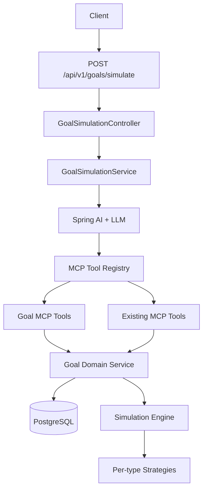

# Goal Simulation

## Goal

Add an AI-driven financial goal simulation feature to SaveAPenny. The user writes a natural-language prompt describing a future financial goal, the system extracts the goal, runs calculations against the user's financial context through the existing MCP tool layer, persists the goal and its scenarios when the user confirms, and reports the result back with a clear, non-advisory summary.

The feature must plug into the existing architecture, not replace it. The assistant, MCP tool layer, security model, audit pipeline, and testing patterns are the foundation.

## Scope Locked From Planning

- **Persistence**: persisted goals, scenarios, and simulation runs.
- **Goal types in v1**: `SAVINGS`, `DEBT_PAYOFF`, `PURCHASE`, `RETIREMENT`, `INCOME_TARGET`.
- **AI orchestration**: tool-calling agent. The LLM extracts inputs, gathers context through MCP, calls a simulation tool, and narrates the result.

## Target Architecture



Existing platform pieces reused:
- `com.saveapenny.mcp.execution`, `com.saveapenny.mcp.registry`, `com.saveapenny.mcp.adapter.springai`
- `com.saveapenny.assistant`, `com.saveapenny.audit`, `com.saveapenny.notification`

## Design Decisions

1. New domain module `com.saveapenny.goal` parallel to other domains.
2. Tool layer over direct repository access: AI never talks to repositories directly.
3. Deterministic engine, agentic wrapper: the engine does the math; the LLM extracts, asks, and narrates.
4. Read-first rollout with limited low-risk writes for user-confirmed persistence.
5. Goal / Scenario / Run separation: user intent, alternative assumptions, and immutable history stay distinct.
6. Disclaimer is mandatory: every simulation narrative includes the platform disclaimer.
7. Multi-currency is warning-only in v1: no FX conversion performed.
8. Embedded MCP only: tools remain internal platform surfaces.

## Conventions

- **Currency**: ISO 4217 three-letter codes stored as `VARCHAR(3)`.
- **Money**: `DECIMAL(19,4)` in storage, `BigDecimal` in Java, never `double`.
- **Dates**: `LocalDate` in Java, `DATE` in PostgreSQL, ISO-8601 strings on the wire.
- **Timestamps**: `OffsetDateTime` in Java, `TIMESTAMP WITH TIME ZONE` in PostgreSQL.
- **IDs**: `UUID`.
- **Enum storage**: `VARCHAR` with `@Enumerated(EnumType.STRING)`.
- **Amount sign convention**: all amounts are positive numbers. Direction is implied by goal type, not sign.
- **JSON columns**: stored as `TEXT` (deviated from original `JSONB` target for H2 compatibility).

## Goal Type Catalog

The v1 catalog contains five goal types. Each type has a stable identifier, required and optional inputs, engine defaults, feasibility rules, and example prompts.

### SAVINGS

Reach a target amount by a target date by accumulating contributions, optionally with an expected annual return.

- **Required**: `targetAmount`, `targetDate`, `currency`
- **Optional**: `monthlyContribution`, `expectedAnnualReturn` (default 0), `startBalance` (default 0)
- **Engine model**: future value of an annuity with optional compounding
- **Feasibility rules** (based on required contribution vs average monthly net income):
  - `INFEASIBLE` if > 80%
  - `AT_RISK` if 50–80%
  - `TIGHT` if 30–50%
  - `ON_TRACK` otherwise
- **Example**: "I want to save $20,000 in 3 years"

### DEBT_PAYOFF

Pay off an existing debt by a target date, given current balance, APR, and minimum payment.

- **Required**: `currentBalance`, `apr`, `currency`
- **Optional**: `minimumPayment`, `monthlyBudget`, `targetPayoffDate`, `fixedPayment`
- **Engine model**: amortization schedule with month-end compounding
- **Feasibility rules**:
  - `INFEASIBLE` if minimum payment < monthly interest
  - `AT_RISK` if payoff requires > 60% of net income
  - `TIGHT` if 30–60%
- **Example**: "I want to pay off my $8,000 credit card in 18 months"

### PURCHASE

Accumulate a down payment toward a future purchase.

- **Required**: `targetPrice`, `targetDate`, `currency`
- **Optional**: `downPaymentPercent` (default 20), `currentDownPayment`, `monthlySaving`, `expectedAnnualReturn`, `expectedPriceInflation`
- **Engine model**: same accumulation as SAVINGS, applied to down payment target with inflation adjustment
- **Feasibility rules**: same bands as SAVINGS
- **Example**: "I want to buy a $300,000 house in 5 years"

### RETIREMENT

Project whether retirement savings are on track to fund a target monthly income.

- **Required**: `currentAge`, `targetRetirementAge`, `currentRetirementSavings`, `currency`
- **Optional**: `monthlyContribution`, `expectedAnnualReturn` (default 7), `expectedInflation` (default 3), `desiredMonthlyIncomeInRetirement`, `lifeExpectancy` (default 85), `withdrawalRate` (default 4)
- **Engine model**: compound growth until retirement, then sustainable withdrawal calculation
- **Feasibility rules**: based on nest egg shortfall percentage
- **Example**: "Will I be able to retire at 65 with $3,000 a month?"

### INCOME_TARGET

Reach a target monthly net income by a target date.

- **Required**: `targetMonthlyNetIncome`, `targetDate`, `currency`
- **Optional**: `currentAverageMonthlyNetIncome`, `expectedIncomeGrowthRate`, `incomeStrategy` (LINEAR or COMPOUND)
- **Engine model**: linear or compound growth from current income to target
- **Feasibility rules**:
  - `INFEASIBLE` if required growth > 5% per month
  - `AT_RISK` if 2–5%
  - `TIGHT` if 0.5–2%
- **Example**: "I want to make $10,000 a month in 2 years"

## Goal Status Lifecycle

```text
DRAFT -> ACTIVE -> ACHIEVED
              \-> ABANDONED
```

| Status | Meaning |
|--------|---------|
| `DRAFT` | Goal created by the agent, not yet confirmed |
| `ACTIVE` | User confirmed the goal, tracked by progress job |
| `ACHIEVED` | Terminal. Set when target is met. |
| `ABANDONED` | Terminal. User or system gave up. |

## Entity Model

### GoalEntity (table `goals`)

| Column | Type | Notes |
|--------|------|-------|
| `id` | UUID PK | |
| `user_id` | UUID NOT NULL | ownership |
| `type` | VARCHAR(32) NOT NULL | one of five goal types |
| `title` | VARCHAR(120) NOT NULL | |
| `target_amount` | DECIMAL(19,4) NOT NULL | |
| `currency` | VARCHAR(3) NOT NULL | |
| `target_date` | DATE NOT NULL | |
| `linked_account_id` | UUID NULL | optional account reference |
| `status` | VARCHAR(16) NOT NULL | from the lifecycle |
| `inputs_json` | TEXT NOT NULL | type-specific inputs as JSON |
| `deleted_at` | TIMESTAMPTZ NULL | soft delete marker |
| `created_at` | TIMESTAMPTZ NOT NULL | |
| `updated_at` | TIMESTAMPTZ NOT NULL | |

### ScenarioEntity (table `goal_scenarios`)

| Column | Type | Notes |
|--------|------|-------|
| `id` | UUID PK | |
| `goal_id` | UUID NOT NULL FK | |
| `name` | VARCHAR(80) NOT NULL | |
| `inputs_json` | TEXT NOT NULL | overrides as JSON |
| `is_baseline` | BOOLEAN NOT NULL | exactly one true per goal |
| `created_at` | TIMESTAMPTZ NOT NULL | |

### GoalRunEntity (table `goal_runs`)

| Column | Type | Notes |
|--------|------|-------|
| `id` | UUID PK | |
| `goal_id` | UUID NOT NULL FK | |
| `scenario_id` | UUID NOT NULL FK | |
| `inputs_snapshot_json` | TEXT NOT NULL | full snapshot frozen at run time |
| `output_summary_json` | TEXT NOT NULL | compact output |
| `output_series_json` | TEXT NULL | full series when explicitly persisted |
| `feasibility` | VARCHAR(16) NOT NULL | cached feasibility |
| `triggered_by` | VARCHAR(16) NOT NULL | USER, AGENT, PROGRESS_JOB, WHAT_IF |
| `created_at` | TIMESTAMPTZ NOT NULL | |

Append-only. No UPDATE or DELETE outside administrative tooling.

## Scenario Input Schema

The `inputs_json` field on GoalEntity and ScenarioEntity is a versioned JSON document:

```json
{
  "version": 1,
  "type": "SAVINGS",
  "values": {
    "targetAmount": 20000.00,
    "currency": "USD",
    "targetDate": "2029-06-06",
    "monthlyContribution": 555.00,
    "expectedAnnualReturn": 0.0,
    "startBalance": 0.00
  }
}
```

Rules:
- `version` is required
- `type` is required and must match the parent goal type for scenarios
- `values` contains per-goal-type fields
- Engine rejects invalid inputs with `VALIDATION_ERROR`

## Simulation Output Schema

```json
{
  "version": 1,
  "type": "SAVINGS",
  "feasibility": "TIGHT",
  "asOf": "2026-06-06T00:00:00Z",
  "horizonMonths": 36,
  "currency": "USD",
  "summary": { "targetAmount": 20000.00, "projectedAmount": 19980.00, "shortfall": 20.00 },
  "assumptions": { "expectedAnnualReturn": 0.0, "startBalance": 0.00 },
  "warnings": [{ "code": "MULTI_CURRENCY", "message": "..." }],
  "series": [{ "month": "2026-07-01", "balance": 555.00, "contribution": 555.00, "interest": 0.00 }]
}
```

### Warning Codes

| Code | Meaning |
|------|---------|
| `MULTI_CURRENCY` | Goal currency differs from primary account currency |
| `MISSING_INCOME_HISTORY` | Fewer than 3 months of income transactions |
| `MISSING_LINKED_ACCOUNT` | Linked account not found at run time |
| `HIGH_APR` | APR >= 25% |
| `NEGATIVE_CASH_FLOW` | Average expense exceeds average income |
| `INFLATION_NOT_SPECIFIED` | Retirement or purchase without inflation input |
| `WITHDRAWAL_RATE_OUT_OF_RANGE` | Withdrawal rate < 2% or > 8% |
| `LONG_HORIZON` | Horizon > 480 months |

## MCP Tool Catalog

### Read Tools

| Tool | Description |
|------|-------------|
| `list_goals` | List the user's goals |
| `get_goal` | Fetch one goal with scenarios and latest run |
| `get_goal_progress` | Current actual vs projection |
| `list_goal_scenarios` | List scenarios for a goal |
| `list_goal_runs` | List run history |
| `simulate_goal` | Run a live simulation |
| `compare_scenarios` | Compare scenarios side by side |
| `what_if` | One-off projection without persistence |

### Low-Risk Write Tools

| Tool | Description |
|------|-------------|
| `create_goal` | Persist a goal, baseline scenario, and initial run |
| `create_scenario` | Add a scenario |
| `update_goal_status` | Apply a valid lifecycle transition |

### High-Impact Write Tools

| Tool | Description |
|------|-------------|
| `update_goal` | Update title, target, date, linked account, or inputs |
| `apply_scenario_as_baseline` | Promote a scenario to baseline |
| `delete_goal` | Soft delete a goal |

## Agent Contract

1. Receive the user's free-form prompt.
2. Choose the goal type.
3. Extract required and optional inputs.
4. Ask follow-up questions if required inputs are missing or ambiguous.
5. Call `simulate_goal`.
6. Present the result, assumptions, and warnings.
7. Ask the user whether to persist the goal.

Rules:
- The agent never invents numbers it does not have.
- The agent never narrates a simulation without a real `SimulationResult`.
- The agent includes the standard non-advisory disclaimer in every simulation response.
- The agent does not call write tools without explicit user confirmation.

## Implementation Status

### Phase 0: Design Lock-In

- [x] Goal type catalog reviewed and signed off.
- [x] Scenario and output schemas approved.
- [x] MCP risk classification table approved.
- [x] Open questions resolved or explicitly deferred.

### Phase 1: Goal Domain Module (Persistence + CRUD)

Implemented. Module structure under `com.saveapenny.goal` with entities, repositories, service, controller, and Flyway migration `V11__create_goal_tables.sql`.

REST surface:
- `POST /api/v1/goals`
- `GET /api/v1/goals` (paginated, filterable by status/type)
- `GET /api/v1/goals/{id}`
- `PATCH /api/v1/goals/{id}`
- `DELETE /api/v1/goals/{id}` (soft delete)
- `PATCH /api/v1/goals/{id}/status`
- `POST /api/v1/goals/{id}/scenarios`
- `GET /api/v1/goals/{id}/scenarios`
- `GET /api/v1/goals/{id}/runs`

Deviations from design: JSON stored as TEXT (not JSONB), `deleted_at` added for soft delete, dedicated status endpoint added.

### Phase 2: Simulation Engine

Implemented. Pure Java engine under `com.saveapenny.goal.simulation` with five strategies, shared math utilities, and no Spring or DB dependencies.

- Five strategies: Savings, DebtPayoff, PurchasePlanning, Retirement, IncomeTarget
- `SimulationMath` with FV, PMT, rate conversion, horizon calculation
- Common warning system across all strategies

### Phase 3: MCP Read Tools for Goals

Implemented. Read-only MCP handlers under `com.saveapenny.mcp.goal`:
- `list_goals`, `get_goal`, `get_goal_progress`, `list_goal_scenarios`, `list_goal_runs`
- `get_goal_progress` returns placeholder `NO_PROJECTION` when no run exists

### Phase 4: Simulation MCP Tool + Endpoint

Implemented. Simulation endpoints and MCP tool:
- `POST /api/v1/goals/simulate`
- `POST /api/v1/goals/simulate/draft`
- `POST /api/v1/goals/{id}/simulate`
- `SimulateGoalToolHandler` exposed through Spring AI adapter
- `GoalContextProviderImpl` derives user context (currency, income, expenses)

Deviations: prompt extraction is deterministic (`SAVINGS` only), not LLM-driven; no persistence path from simulation yet.

### Phase 5: Scenarios, Comparison, and What-If

Implemented.
- `POST /api/v1/goals/{id}/scenarios/compare` (capped at 10 scenarios)
- `POST /api/v1/goals/{id}/what-if`
- `compare_scenarios` and `what_if` MCP handlers

### Phase 6: Progress Tracking and Off-Track Alerts

Implemented.
- `GoalProgressCalculatorImpl` for deterministic progress calculation
- `GoalProgressJob` scheduled job evaluating active goals
- `GoalOffTrackNotifier` with idempotency gate
- `GetGoalProgressToolHandler` delegates to calculator
- Flyway migration `V12__add_goal_off_track_notification_type.sql`

Known issue: off-track streaks tracked in memory (lost on restart).

### Phase 7: Safety, Observability, and Governance

Planned. Risk classification enforcement, audit events for goal writes, rate limits, Micrometer metrics, structured logging.

### Phase 8: Documentation and Polish

Planned. Finalize all documentation, add prompt examples, verify OpenAPI coverage.

## Testing Strategy

Three layers:

### Unit Tests
- Each simulation strategy
- `GoalContextProvider` with mocked dependencies
- Tool validators
- DTO/entity mapping

### Integration Tests
- `GoalFlowIntegrationTest`
- `GoalSimulationFlowIntegrationTest`
- `GoalProgressJobIntegrationTest`
- MCP tool integration tests including auth and ownership

### Contract Tests
- Tool name and schema stability
- Simulation output schema stability
- OpenAPI coverage

Regression coverage includes: empty transaction history, missing linked account, mixed-currency data, long/short horizons, off-track/on-track/infeasible scenarios, concurrent simulation runs.

## Risks and Mitigations

| Risk | Mitigation |
|------|------------|
| LLM extracts wrong type or amount | Parsed input surfaced to user before persistence |
| Simulation output creates false certainty | Mandatory disclaimer, explicit assumptions, structured warnings |
| Agent writes without user intent | Confirmation gate, audit trail, ownership checks, risk policy |
| Progress tracking generates noise | Idempotent notifications, configurable thresholds |
| Schema drift between engine and tool output | One shared `SimulationResult` model |

## What Not To Do

- Do not expose repositories as tools.
- Do not let the LLM do math.
- Do not store the full series by default for every run.
- Do not use chat persistence as the only simulation history.
- Do not skip the disclaimer.
